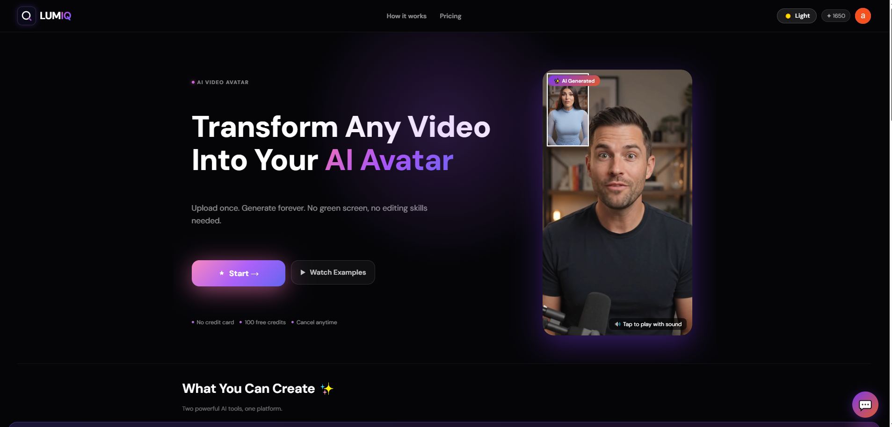
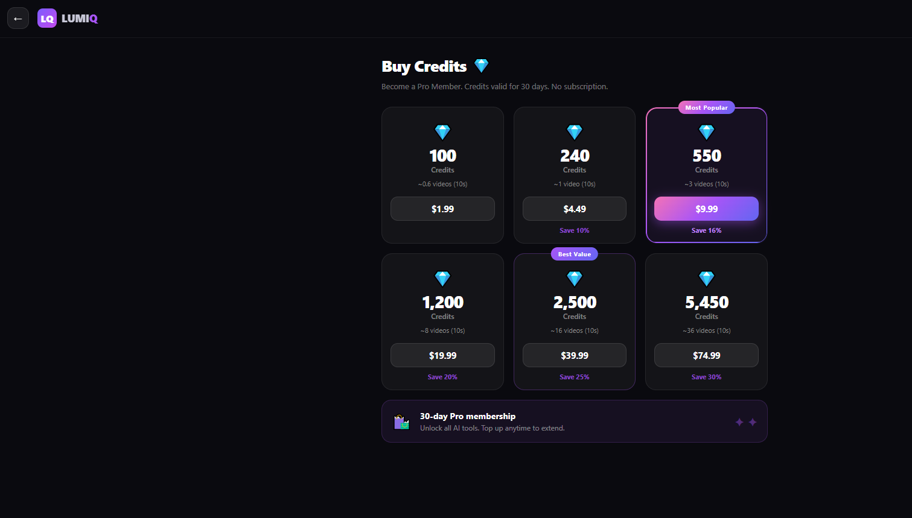
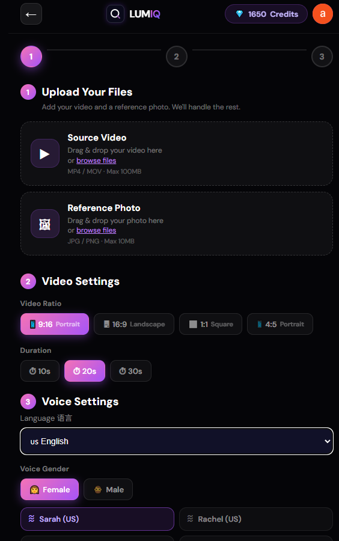
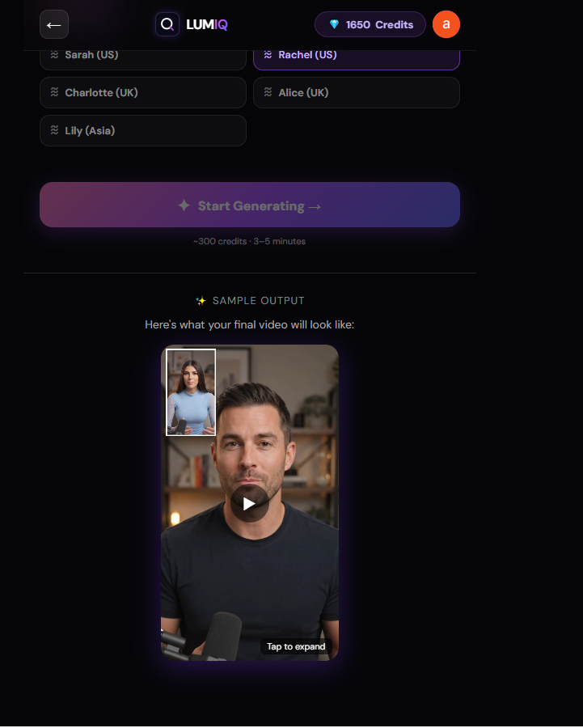
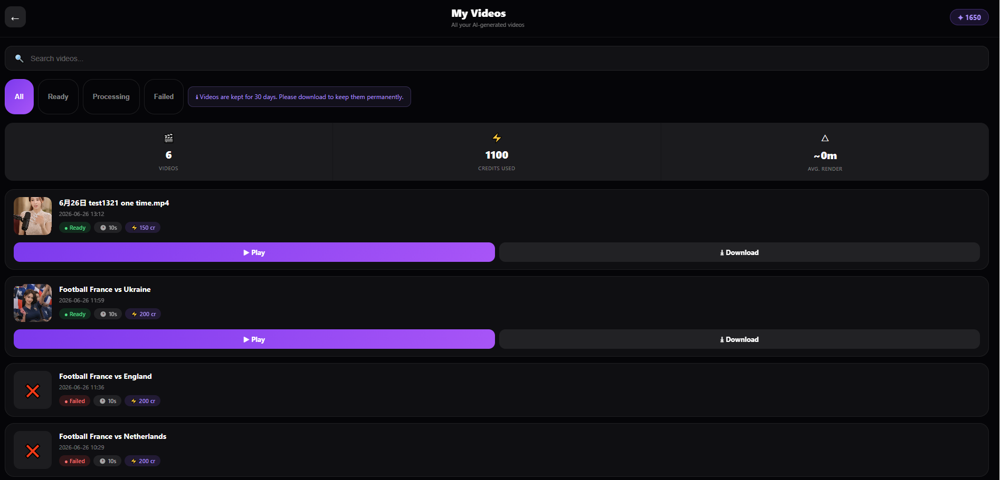
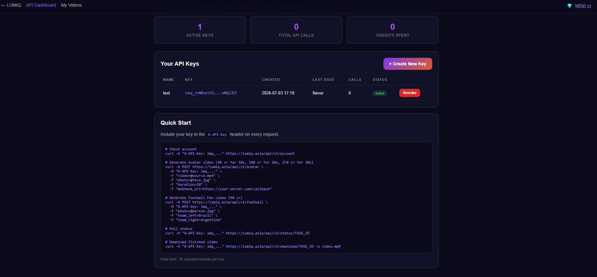
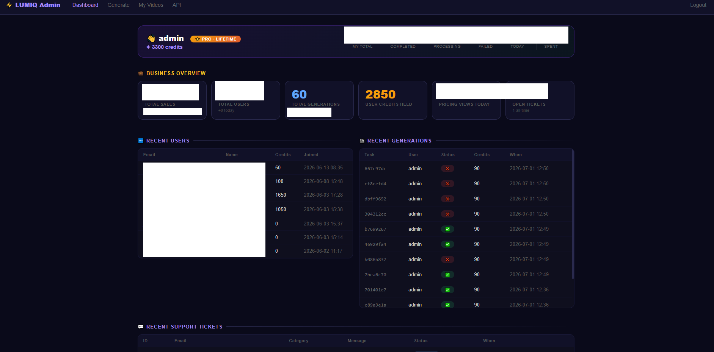

# 🎬 LUMIQ — Production AI Video Generation Platform

> 🌐 Live: [lumiq.asia](https://lumiq.asia) · 📚 API Docs: [docs.lumiq.asia](https://docs.lumiq.asia)  
> Solo-built · Real payments · Multi-AI pipeline · Kuala Lumpur 🇲🇾

---

## ⚠️ Source Code Notice

This is a showcase repository documenting the LUMIQ platform.  
Source code, architecture details, and vendor integrations are proprietary and not published here.  
For technical discussions or work references, please [visit lumiq.asia](https://lumiq.asia) to contact me.

---

## 🚀 What is LUMIQ?

LUMIQ is a production SaaS platform that transforms user photos and videos into AI-generated content — face swap avatars, sports fan videos, and cinematic scenes. Built solo, currently serving paying customers with Stripe payments and public API access.

Try it live: [lumiq.asia](https://lumiq.asia) · Sign in with Google · 50 free credits

---

## ✨ Product Screenshots

### 🏠 Homepage & Landing

Modern landing page with real-time demo video showing AI avatar transformation.

### 💎 Buy Credits (Pricing)

6-tier credit packages from $1.99 to $74.99. Custom credit expiry system with 30-day validity, presented as "Pro Membership" for better UX.

### 🎬 Video Generation Flow — Upload Stage

Multi-step wizard: Upload files → Configure settings → Generate. Supports common video and image formats.

### 🎙️ Video Generation Flow — Voice Selection

Multi-language voice cloning with professional voice presets across regions (US / UK / Asia).

### 📼 My Videos Dashboard

User workspace showing all generated videos with status filters (All / Ready / Processing / Failed), search, and 30-day retention policy.

### 🔌 Public API Dashboard

REST API access with key management, usage tracking, and complete cURL documentation for all endpoints.

### 🔧 Admin Dashboard (Internal)

Full business overview: total sales, users, generations, credits held, pricing views, and recent user/generation tables. Support ticket system integrated.

---

## ✨ Core Features

### 🎭 AI Avatar Generator

Transform any video into your AI digital human.

- Face swap with motion tracking
- Multi-language voice cloning
- Custom innovation: Proprietary audio processing pipeline that preserves original background audio while replacing speaker voice
- Selectable durations and aspect ratios

### ⚽ Football Fan 2026

Places users in World Cup crowd scenes with 48-team support and dynamic assets.

### 🏆 FIFA Pro

Cinematic short-form football match videos with multi-step AI pipeline.

### 💎 Credit System (Business Logic)

- FIFO batch tracking with 30-day expiry
- Automatic cron-based expiration
- Refund verification: Only refunds credits AFTER verifying no upstream cost was incurred
- Pro Member status for paying users
- Multi-tier: Regular users / Admin / Shareholder accounts

### 🔌 Public API

- REST endpoints for programmatic access
- Rate limiting per key
- Webhook callbacks on completion
- Full documentation at [docs.lumiq.asia](https://docs.lumiq.asia)

---

## 🏗️ Tech Stack (High-Level)

| Layer | Technologies |
|-------|--------------|
| Backend | Python · Flask · SQLite |
| Payments | Stripe (Checkout + Webhooks) |
| Auth | OAuth 2.0 · Custom admin auth |
| AI Integrations | Multiple production-grade AI providers (LLM, image gen, voice, motion synthesis, video gen) — specifics proprietary |
| Infrastructure | Ubuntu VPS · Nginx (reverse proxy + SSL) · Let's Encrypt · systemd · Cron |
| Frontend | Vanilla JavaScript · Server-rendered HTML · Mobile-first |

---

## 🔧 Engineering Highlights

### Zero-Downtime Domain Migration

Migrated production between domains with:

- Full DNS reconfiguration
- SSL certificate re-signing
- Reverse proxy migration
- OAuth redirect URI updates
- Payment webhook endpoint migration
- Zero user-visible downtime

### Multi-Tier Authentication System

- OAuth-based user accounts with session persistence
- Isolated admin dashboard (separate credit pool)
- Shareholder-tier pricing structure
- Public API key system with rate limiting

### Robust Error Handling

- Content moderation edge case handling (auto-refund on API rejection)
- Extended timeout handling for long AI jobs
- Stuck-task recovery via cron scanning
- Refunds only trigger after verifying no upstream cost was incurred

### Multi-Language Support

Voice pipeline supports 7 languages across major regions.

### Business Logic: FIFO Credit Batches

Non-trivial credit expiry system:

- Each purchase creates a batch with 30-day expiry
- Deductions use FIFO ordering
- Nightly cron marks expired batches and syncs balance
- Admin accounts get lifetime credits
- Refunds create new batches (30-day reset)

---

## 📊 Production Scale

- Live production with paying customers via Stripe
- 6 credit packages ($1.99 to $74.99)
- Multi-domain setup: lumiq.asia + docs.lumiq.asia
- Uptime: 99.9% via systemd auto-restart + Nginx failover
- Payment processing: Stripe with signed webhooks (HMAC verification)
- Public API with rate-limited key management

---

## 🎯 Solo-Built Scope

Everything you see was designed, coded, deployed, and maintained by me:

- ✅ Full-stack architecture & implementation
- ✅ Multi-provider AI integration & error handling
- ✅ Payment processing & webhook signature verification
- ✅ DNS / SSL / Nginx / systemd / cron configuration
- ✅ Custom admin panel with real-time analytics
- ✅ FIFO credit batch system with auto-expiry
- ✅ Public REST API + rate limiting + docs portal
- ✅ Content moderation edge case handling
- ✅ Multi-language voice pipeline
- ✅ Zero-downtime domain migration

---

## 🌐 Live Demo

Best way to see it: Visit [lumiq.asia](https://lumiq.asia)

- Sign in with Google (new users get 50 free credits)
- Try the Avatar Generator or Football Fan
- Explore the Pricing page and Public API dashboard

API Documentation: [docs.lumiq.asia](https://docs.lumiq.asia)

---

## 💼 About This Project

- Duration: 6+ months of active development
- Role: Founder · Full-stack engineer · Solo operator
- Status: Production · Actively maintained · Growing

---

## 📬 Contact

- 🌐 Live product: [lumiq.asia](https://lumiq.asia)
- 💼 Portfolio: [github.com/kelvin-builds](https://github.com/kelvin-builds)
- 📍 Location: Kuala Lumpur, Malaysia 🇲🇾

---

## 🔒 Copyright

© 2026 LUMIQ. All rights reserved. Source code, architecture, and vendor integrations are proprietary.

This showcase repository is for portfolio and reference purposes only.
